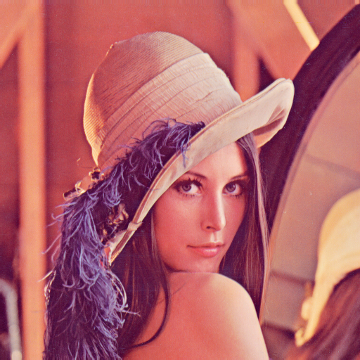
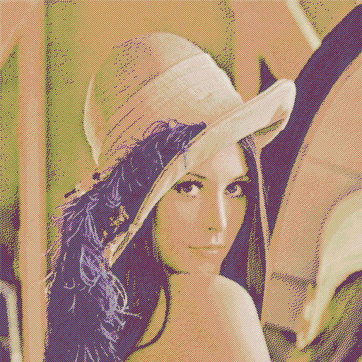
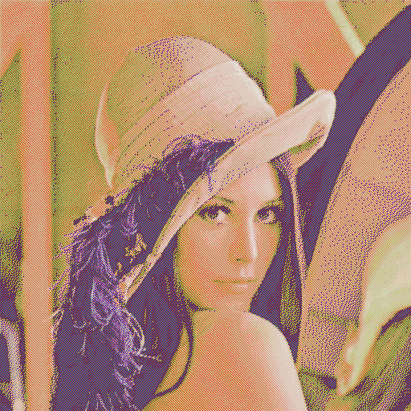
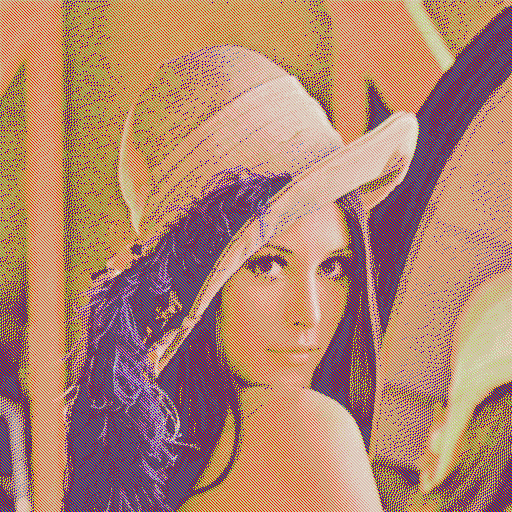
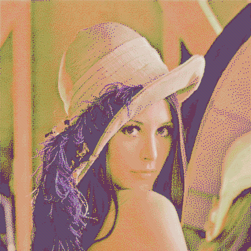
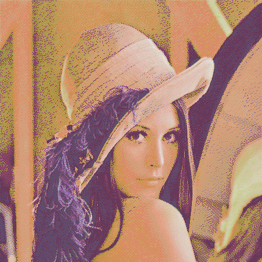

# DitherC

dither.c uses the Stucki kernel and the cyclic row selector

```bash
make
./build/dither -k atkinson > img_atkinson.h
./build/dither -k stucki > img_stucki.h
./build/dither -k floyd   > img_floyd.h
./build/dither -k jarvis > img_jarvis.h
./build/dither -k burkes > img_burkes.h
./build/dither -k sierra > img_sierra.h
```

| **original input**  |                |                |                |                |
| :------------------ | :---------------------------------------------------- | :----------------------------------------------------- | :----------------------------------------------------- | :----------------------------------------------------- |
| **atkinson output** |  |  |  |  |
| **burkes output**   |    |    |    |    |
| **floyd output**    |     |     |     |     |
| **jarvis output**   |    |    |    |    |
| **sierra output**   |    |    |    |    |
| **stucki output**   |    |    |    |    |
